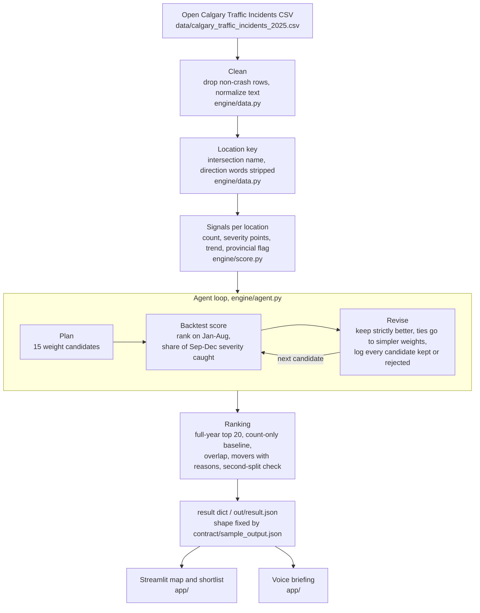

# Architecture

## Why this design

The whole pipeline is pandas over one table of a few thousand rows, so there is no database, no service and nothing to deploy beyond the app.

There is no model training: the score is a weighted mix of counts the City already publishes, so every rank can be traced back to the incidents behind it.

The agent tests its own weights by ranking on the earlier months and checking how much of the later harm its top 20 caught, and it keeps count-only when nothing beats it.

A full run, including the 15-candidate search, finishes in under 2 seconds on a laptop, so the app can re-run the engine live while someone moves a slider.

The engine reads the same columns as the Open Calgary Traffic Incidents feed, so a newer export loads with no change to cleaning or scoring; only the date windows at the top of engine/agent.py move to the new year.
