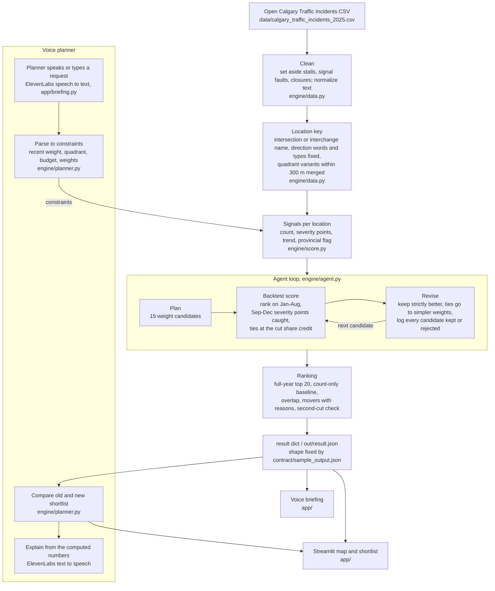

# Architecture

## Why this design

The whole pipeline is pandas over one table of a few thousand rows, so there is no database, no service and nothing to deploy beyond the app.

There is no model training: the score is a weighted mix of incident counts and keyword tags taken from the City's own incident text, so every rank can be traced back to the rows behind it.

The agent tests its own weights by ranking on the earlier months and counting how many later severity points its top 20 caught, and it keeps count-only when nothing beats it. The second cut overlaps the first test window, so it is reported as a check, not a held-out test.

The data is loaded and scored once per file version, so after the first call a full run, including the 15-candidate search, takes well under a second and the app can re-run the engine live while someone moves a slider.

A newer export of the Open Calgary Traffic Incidents feed with the same columns should load unchanged, as long as the City keeps its description wording; only the date windows at the top of engine/agent.py move to the new year.

The planner parses requests with fixed rules rather than a language model, so the same words always give the same constraints, it works offline, and a request it cannot read changes nothing instead of guessing.
